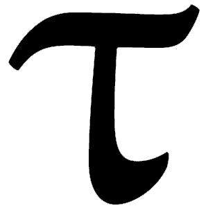

<p align="center">
  
  <h3 align="center">TAU</h3>
</p>

> The **Greek letter τ (tau)** is a suggested symbol for the circle constant representing the ratio between circumference and radius. The constant is equal to 2π (2 times pi), and approximately 6.28.
> Source: [math.wikia](http://math.wikia.com/wiki/Tau_(constant))

## Why?

**Read the [Tau Manifesto](https://tauday.com/tau-manifesto)!**

[](https://www.youtube.com/watch?v=jG7vhMMXagQ)

## Usage

Installing
```bash
yarn add tau-js
```

```javascript
const tau = require('tau-js');
```

Calculating the circumference of a circle
```javascript
const calculateCircumference = radius => tau * radius;
calculateCircumference(10) // 62.83185307179586
```

Euler's Formula
```javascript
const eulerFormula = i => Math.cos(tau) + i * Math.sin(tau)
eulerFormula(0) // Always (almost) 1
```

Extending native Math object
```javascript
Math.TAU = tau;
```

## Testing
Run `npm test` or testling to run the test suite.

## License
tau-js is currently under M.I.T license.